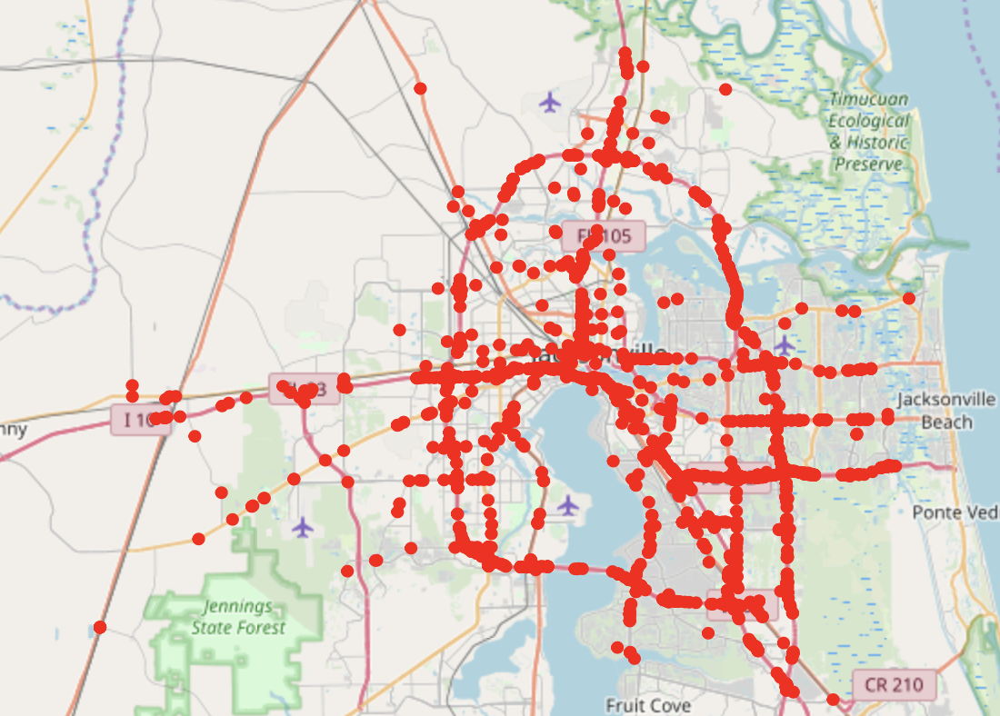

# US Accidents 2019 filtered by state, city, and severity
Filter US Accidents 2019 dataset by state, city, and severity and render a map of the city with all accidents marked. This can be used to analyze traffic safety patterns and controls.

## Dataset
US Accicents 2019 dataset is pulled from [Kaggle](https://www.kaggle.com/sobhanmoosavi/us-accidents)

## Dependencies (currently)

* numpy
* ipyleaflet

## Format

Jupyter Notebook

## How To Use

Open up `us_accident.ipynb`. Change input parameters in 5th cell to desried:

* `state`
* `city`
* `severity`

Then RUN ALL

# Example of rendered map

Here's a map of Jacksonville, FL, severity 4

# TODO:

* Make a GUI by adding widgets and update map based on widgets
* Efficient coding to reduce runtime
